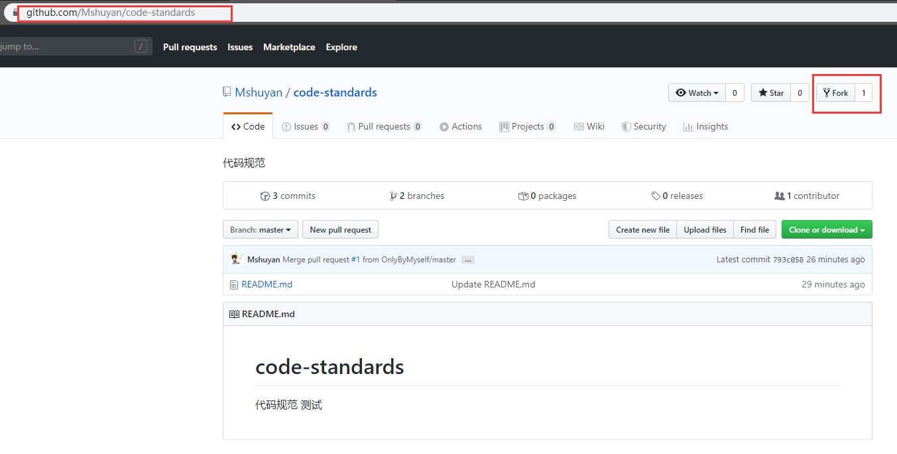
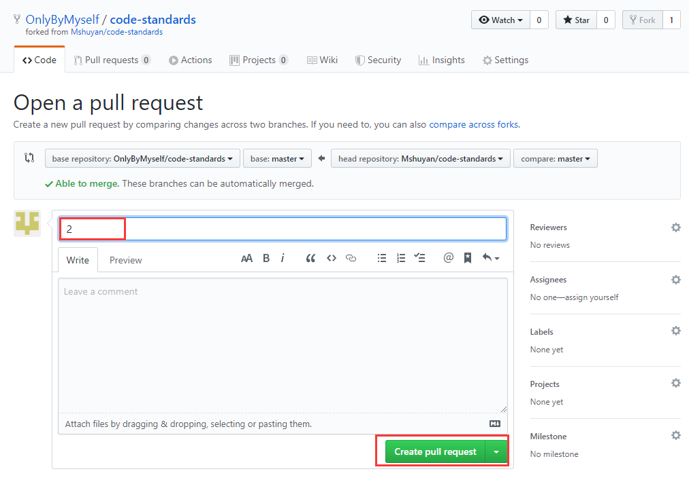
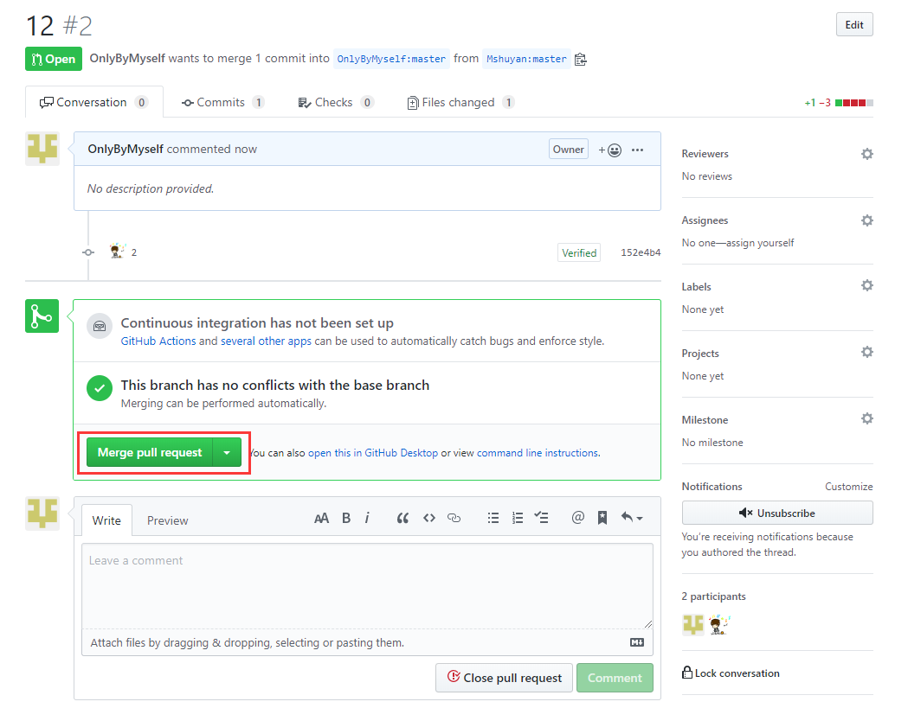

# [代码规范传送门](./CodeStandards.md)

# 如何贡献你的规范

## 获取项目

+ 登录你的`github`

+ 找到本项目，并`fork`

    

+  `fork`后，你的`github`账号中，会产生1个该项目的副本，你可以在你的项目中进行更改

## 从原作者项目中获取变更

+ 下图按钮，任点1个

   

+ 左侧选择为自己的项目

   

+ 点击`compare across forks`

   

+ 右侧选择为原作者项目

   

+ 点击`create pull request`

   

+ 输入标题，并`Create pull request`

   

+ 合并修改

   

## 将修改提交给原作者

+ 下图按钮，任点1个

   

+ 点击`Create pull request`

   

+ 输入`title`，点击`create pull request`

   

  等待原作者回复即可